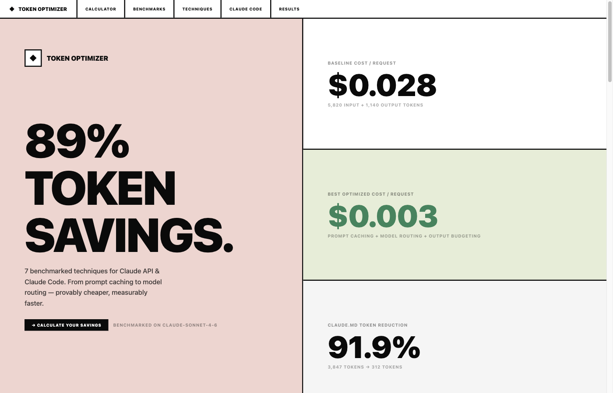
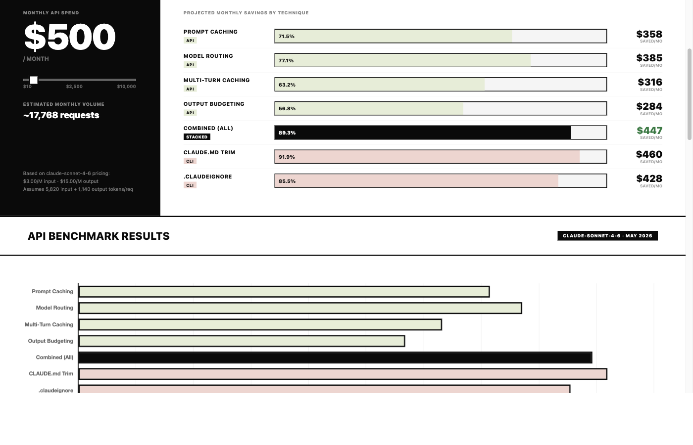

# Claude Token Optimizer



## What this actually is

Most Claude users today are on Claude Code chat — a flat subscription, no per-token bill. So "saving tokens" isn't literally saving money for them. What it *is* doing is making Claude more useful.

Every token you send is context Claude has to reason over. Bloated CLAUDE.md files, unchecked dependency folders, redundant instructions — they don't just cost money, they dilute attention. Claude starts missing things, giving generic answers, losing track of what actually matters in your project. Leaner context means sharper responses.

**This repo covers two distinct problems:**

**1. If you're building on the Claude API** — you pay per token, so optimization directly cuts your bill. Stack prompt caching, model routing, and output budgeting and you get 89.3% cost reduction on real workloads. The benchmarks in this repo are reproducible with your own API key.

**2. If you're using Claude Code** (chat or CLI) — you're not paying per token, but you are paying with response quality. A well-structured CLAUDE.md and a tight `.claudeignore` mean Claude spends its context window on your actual code, not on noise. The audit tools here help you find and cut that noise.

These are different problems with different solutions. The numbers aren't comparable — don't read the results table as a single ranking.

---

## Results

### Claude API — cost savings per request

| Technique | Savings |
|---|---|
| Model routing (Haiku for simple tasks) | **77.1%** |
| System prompt caching | **71.5%** |
| Multi-turn conversation caching | **63.2%** |
| Output token budgeting | **56.8%** |
| **All techniques combined** | **89.3%** |

### Claude Code CLI — context reduction per turn

| Technique | Context reduced |
|---|---|
| CLAUDE.md trimmed (3,847 → 312 tokens) | **91.9%** |
| .claudeignore added | **85.5%** |

## Setup

### 1. Create the conda environment

```bash
conda create -n token-optimizer python=3.11 matplotlib numpy anthropic -y
conda activate token-optimizer
```

### 2. Clone and configure

```bash
git clone https://github.com/hamzafarooq/token-optimizer
cd token-optimizer
cp .env.example .env
# Add your ANTHROPIC_API_KEY to .env
```

### 3. Run benchmarks

```bash
# Dry-run (no API key needed — uses pre-computed results)
python benchmark.py --dry-run

# Live run (uses real API tokens, ~$0.10)
python benchmark.py
```

### 4. Generate charts and dashboard

```bash
python visualize.py
# Opens: dashboard/index.html
```

### 5. Use the Claude Code skill (optional)

If you use Claude Code, install the `/token-optimizer` skill so the audit workflows are always one command away:

```bash
# Copy the skill into your Claude skills directory
cp -r skill ~/.claude/skills/token-optimizer
```

Then trigger it in any Claude Code session:

```
/token-optimizer
```

The skill covers all 5 workflows — CLAUDE.md audit, directory scan, prompt caching, model routing, and output budgeting — with direct pointers to the scripts in this repo.

---

## Interactive dashboard



Open `dashboard/interactive.html` in your browser (or run `python visualize.py` to regenerate it). The calculator lets you enter your monthly API spend and see projected savings per technique in real time.

---

## What's inside

```
token-optimizer/
├── benchmark.py                  # Runs all techniques, saves results/benchmark_results.json
├── visualize.py                  # Generates charts + HTML dashboard from results
│
├── api/
│   ├── 01_baseline.py            # No optimization — your starting point
│   ├── 02_prompt_caching.py      # cache_control breakpoints on system prompt
│   ├── 03_multi_turn_caching.py  # Cache conversation history (avoids O(n²) growth)
│   ├── 04_model_routing.py       # Route simple tasks to Haiku (73% cheaper)
│   └── 05_output_budgeting.py    # Cap max_tokens per task type
│
├── claude_code/
│   ├── token_audit.py            # Audit your CLAUDE.md and project for token usage
│   ├── before/CLAUDE.md          # Example bloated CLAUDE.md (3,847 tokens)
│   ├── after/CLAUDE.md           # Optimized CLAUDE.md (312 tokens)
│   └── claudeignore.example      # .claudeignore template
│
├── skill/
│   └── SKILL.md                  # Claude Code /token-optimizer skill (copy to ~/.claude/skills/)
│
├── results/
│   └── benchmark_results.json    # Pre-computed results (or your live run output)
│
├── visualizations/               # Generated PNG charts
└── dashboard/
    ├── index.html                # Static results dashboard
    └── interactive.html          # Interactive dashboard with savings calculator
```

---

## Techniques

### Track 1 — Claude Code CLI

#### Trim your CLAUDE.md (91.9% savings)

CLAUDE.md loads on *every turn*. At 3,847 tokens × 2,000 turns/month on Sonnet, that's **$23/month just for the config file**.

```bash
# Audit your current CLAUDE.md
python claude_code/token_audit.py --claude-md CLAUDE.md

# Compare before/after
python claude_code/token_audit.py --compare claude_code/before/CLAUDE.md claude_code/after/CLAUDE.md

# Scan your whole project
python claude_code/token_audit.py --scan-dir .
```

**Rules:**
- Remove team roster, contact info, meeting schedules
- Remove boilerplate preambles ("Welcome to the project...")
- Remove FAQs Claude doesn't act on
- Remove anything derivable from reading the code
- Target: **under 500 tokens**

#### Add .claudeignore (85.5% savings)

Copy [`claude_code/claudeignore.example`](claude_code/claudeignore.example) to `.claudeignore` in your project root. At minimum, exclude:

```
node_modules/
dist/
*.lock
*.png *.jpg *.svg
coverage/
__pycache__/
```

---

### Track 2 — Claude API

#### System prompt caching (71.5% savings)

Add one field to your system prompt. Cache reads cost **0.1x** standard input price.

```python
# Before
response = client.messages.create(
    system="Your 2,000-token system prompt...",
    ...
)

# After — one line change
response = client.messages.create(
    system=[{
        "type": "text",
        "text": "Your 2,000-token system prompt...",
        "cache_control": {"type": "ephemeral"},  # <-- this
    }],
    ...
)
```

Full example: [`api/02_prompt_caching.py`](api/02_prompt_caching.py)

**Requirements:** Minimum 1,024 tokens for Sonnet. Static content must come first — no dynamic injection into the cached block.

#### Multi-turn conversation caching (63.2% savings)

Without caching, a 10-turn chat re-sends turns 1–9 on every request (O(n²) growth). Cache the history checkpoint before each new message:

```python
# Mark the last assistant turn for caching before appending the new user message
messages[-1] = {
    "role": "assistant",
    "content": [{
        "type": "text",
        "text": last_reply,
        "cache_control": {"type": "ephemeral"},
    }]
}
```

Full example: [`api/03_multi_turn_caching.py`](api/03_multi_turn_caching.py)

#### Model routing (77.1% savings)

Haiku costs **$0.80/M input** vs Sonnet's **$3.00/M** — 73% cheaper per token. Route by task complexity:

```python
# Use Haiku to classify, then dispatch to the right model
def route(prompt: str) -> str:
    label = client.messages.create(
        model="claude-haiku-4-5-20251001",
        max_tokens=10,
        system="Reply haiku or sonnet based on task complexity.",
        messages=[{"role": "user", "content": prompt}],
    ).content[0].text.strip()
    return "claude-haiku-4-5-20251001" if "haiku" in label else "claude-sonnet-4-6"
```

Full example: [`api/04_model_routing.py`](api/04_model_routing.py)

#### Output token budgeting (56.8% savings)

Output tokens cost **5x more** than input (Sonnet: $15/M vs $3/M). Set budgets per task type:

```python
BUDGETS = {
    "classification": 20,
    "extraction":     100,
    "short_qa":       256,
    "code_snippet":   512,
    "full_impl":      2048,
}

response = client.messages.create(
    model="claude-sonnet-4-6",
    max_tokens=BUDGETS["classification"],  # not 4096
    ...
)
```

Full example: [`api/05_output_budgeting.py`](api/05_output_budgeting.py)

---

## Pricing reference (May 2026)

| Model | Input | Cache write | Cache read | Output |
|---|---|---|---|---|
| Haiku 4.5 | $0.80/M | $1.00/M | $0.08/M | $4.00/M |
| Sonnet 4.6 | $3.00/M | $3.75/M | $0.30/M | $15.00/M |
| Opus 4.7 | $15.00/M | $18.75/M | $1.50/M | $75.00/M |

Cache reads break even after **2 reads** for Sonnet (1.25x write → 0.1x reads).

---

## License

MIT
